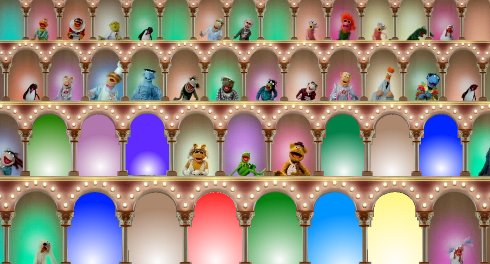

# Muppets Arches for Microsoft Teams Together Mode
It's time to play the music, it's time to light the lights with your co-workers in Together Mode in Microsoft Teams!

## Build status

## Installing and use
This is intended for personal use, with your own Microsoft Teams installation and supports up to 12 members in together mode.

Please find the MuppetsTeamsTogether.zip file attached to the latest release, under 'Assets'.

This zip file should be uploaded using the [Microsoft Teams Developer portal](https://dev.teams.microsoft.com/scenes) which has the "Import a scene" option in the toolbar for the Tools section. Here you can select the downloaded MuppetsTeamTogether.zip archive and upload it to your studio where you will be able to edit and publish it for your own teams installation.

## Contributing
This project welcomes contributions of all types. If you have any improvements or suggestions please raise a pull request or an issue if preferred.
